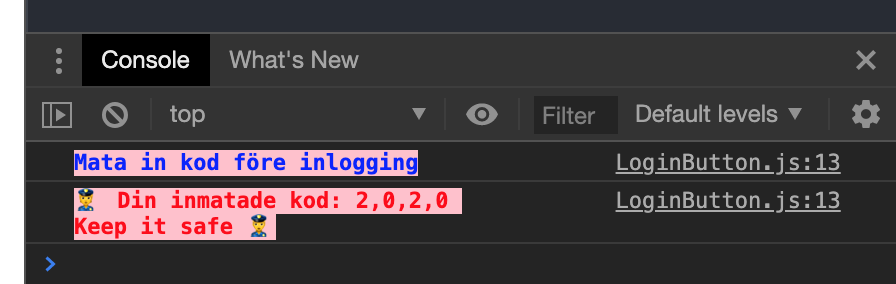

# A Keypad application built in React

A Keypad application built in React. The keypad is a bit odd since it on top of the ten clickable keys also has six non-clickable keys and also note that the keys gets scrambled upon reloading of the page.

- When clicking the numbered keys the number gets saved to state and a \* marks that it has been added
- Upon clicking `Logga in` the entered code gets revealed in the Developer Console
- Upon clicking `X` the last entered digit gets deleted from state and the UI

All components are class-based.

## Using create-react-app

The project was initialized with create-react-app, [Create React App](https://github.com/facebook/create-react-app)

`$ npx create-react-app .` (runs create-react-app in the current folder)

## Installed dependencies

There are no dependencies installed on top of the once added with create-react-app.

# Instructions to run the application

Run these commands in the project directory: 
Installing dependencies 
`$ npm install`

Starting the application in development mode 
`$ npm start`

This should open the application in the browser, otherwise go to: 
[http://localhost:3000](http://localhost:3000) 
The page will reload if you make code edits.

# Screenshots

Keypad application

Clicking `Logga in` with no code entered and with code entered

 
 

## Author

- Albert Stjärne (https://github.com/AlbertStjarne)
